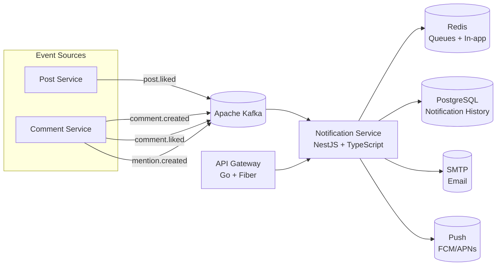

<p align="center">
  
</p>

<p align="center">
  
  
  
  
  
</p>

---

## 📝 Overview

**Notification Service** handles real-time user notifications for the A4AD Forum. It listens to Kafka events from other services (comments, likes, mentions) and delivers notifications through multiple channels: in-app (Redis), email, and push notifications.

---

## ✨ Features

- 🔔 **Real-time Notifications** — Instant delivery of in-app notifications
- 📧 **Email Notifications** — SMTP/3rd party email delivery (SendGrid, Resend)
- 📱 **Push Notifications** — FCM/APNs support (placeholder for future)
- 👤 **Mention Detection** — Auto-detect @username mentions in content
- 📊 **Notification History** — Persistent storage in PostgreSQL/MongoDB
- ✅ **Read Status** — Mark notifications as read/unread
- 🎯 **Smart Batching** — Group similar notifications to reduce noise
- ⚡ **Event-Driven** — Kafka consumers for all forum events

---

## 🛠 Tech Stack

- **Framework:** NestJS 10+
- **Language:** TypeScript 5.0+
- **Message Broker:** Apache Kafka
- **Cache & Queues:** Redis (Bull/ BullMQ)
- **Storage:** PostgreSQL or MongoDB for history
- **Email:** Nodemailer + SMTP / SendGrid / Resend
- **Events:** @nestjs/microservices (Kafka)
- **Scheduling:** @nestjs/schedule
- **Testing:** Jest + Supertest

---

## 📊 Architecture



---

## 🚀 Quick Start

### Prerequisites

- Node.js 20+
- pnpm (recommended) or npm
- Apache Kafka
- Redis 7+
- PostgreSQL or MongoDB (optional, for history)
- Docker & Docker Compose (optional)

### Installation

1. **Clone the repository:**
   ```bash
   git clone https://github.com/A4AD-team/notification-service.git
   cd notification-service
   ```

2. **Install dependencies:**
   ```bash
   pnpm install
   # or: npm install
   ```

3. **Start infrastructure:**
   ```bash
   docker compose up -d kafka redis postgres
   ```

4. **Configure environment:**
   ```bash
   cp .env.example .env
   # Edit .env with your Kafka, Redis, and SMTP credentials
   ```

5. **Run the service:**
   ```bash
   # Development mode with hot reload
   pnpm run start:dev

   # Production build
   pnpm run build
   pnpm run start:prod
   ```

The service will be available at `http://localhost:8085`

---

## 🔧 Environment Variables

| Variable | Description | Default | Required |
|----------|-------------|---------|----------|
| `NODE_ENV` | Environment (development, production) | `development` | No |
| `PORT` | HTTP server port | `8085` | No |
| `KAFKA_BROKERS` | Kafka broker addresses | `localhost:9092` | Yes |
| `KAFKA_CLIENT_ID` | Kafka client ID | `notification-service` | No |
| `KAFKA_GROUP_ID` | Kafka consumer group | `notification-group` | No |
| `REDIS_HOST` | Redis hostname | `localhost` | Yes |
| `REDIS_PORT` | Redis port | `6379` | No |
| `REDIS_PASSWORD` | Redis password | `` | No |
| `REDIS_DB` | Redis database number | `0` | No |
| `DATABASE_URL` | PostgreSQL/MongoDB connection string | `` | No |
| `ENABLE_EMAIL` | Enable email notifications | `false` | No |
| `SMTP_HOST` | SMTP server hostname | `` | If email enabled |
| `SMTP_PORT` | SMTP server port | `587` | No |
| `SMTP_USER` | SMTP username | `` | If email enabled |
| `SMTP_PASS` | SMTP password | `` | If email enabled |
| `SMTP_FROM` | From email address | `noreply@a4ad.forum` | No |
| `ENABLE_PUSH` | Enable push notifications | `false` | No |
| `NOTIFICATION_RETENTION_DAYS` | History retention period | `90` | No |
| `MAX_NOTIFICATIONS_PER_USER` | Max stored notifications | `1000` | No |
| `BATCHING_ENABLED` | Enable notification batching | `true` | No |
| `LOG_LEVEL` | Logging level | `info` | No |

---

## 📡 API Endpoints

### Notifications

| Method | Path | Description | Auth Required |
|--------|------|-------------|---------------|
| `GET` | `/api/v1/notifications` | List user notifications | Yes |
| `GET` | `/api/v1/notifications/unread-count` | Get unread count | Yes |
| `PATCH` | `/api/v1/notifications/:id/read` | Mark as read | Yes |
| `PATCH` | `/api/v1/notifications/read-all` | Mark all as read | Yes |
| `DELETE` | `/api/v1/notifications/:id` | Delete notification | Yes |

### Preferences

| Method | Path | Description | Auth Required |
|--------|------|-------------|---------------|
| `GET` | `/api/v1/notifications/preferences` | Get notification preferences | Yes |
| `PATCH` | `/api/v1/notifications/preferences` | Update preferences | Yes |

### Query Parameters

| Parameter | Description | Default |
|-----------|-------------|---------|
| `limit` | Notifications per page | `20` |
| `cursor` | Pagination cursor | `` |
| `includeRead` | Include read notifications | `false` |
| `type` | Filter by type (comment, like, mention, reply) | `` |

### Example Notification Response

```json
{
  "id": "notification-uuid",
  "userId": "user-uuid",
  "type": "comment_reply",
  "title": "New Reply",
  "message": "johndoe replied to your comment",
  "data": {
    "commentId": "comment-uuid",
    "postId": "post-uuid",
    "replyId": "reply-uuid",
    "actor": {
      "userId": "actor-uuid",
      "username": "johndoe",
      "avatarUrl": "https://cdn.example.com/avatars/johndoe.png"
    }
  },
  "isRead": false,
  "channels": ["in_app", "email"],
  "createdAt": "2026-02-12T15:30:00Z"
}
```

---

## 🩺 Health Checks

| Endpoint | Method | Description |
|----------|--------|-------------|
| `/health` | `GET` | Overall health status |
| `/health/live` | `GET` | Liveness probe |
| `/health/ready` | `GET` | Readiness probe (checks Kafka & Redis) |
| `/metrics` | `GET` | Prometheus metrics |

### Example Response

```json
{
  "status": "ok",
  "timestamp": "2026-02-12T15:30:00Z",
  "version": "0.1.0",
  "checks": {
    "kafka": "connected",
    "redis": "connected",
    "database": "connected"
  }
}
```

---

## 🧪 Testing

```bash
# Run all tests
pnpm test

# Run tests with coverage
pnpm test -- --coverage

# Run tests in watch mode
pnpm test:watch

# Run specific test
pnpm test -- notification.service.spec

# Run e2e tests
pnpm test:e2e
```

---

## 📄 License

This project is licensed under the MIT License — see the [LICENSE](LICENSE) file for details.

---

<p align="center">
  <strong>Built with ❤️ by A4AD Team</strong>
</p>
