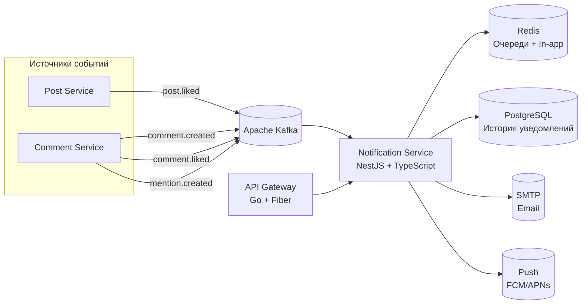

<p align="center">
  
</p>

<p align="center">
  
  
  
  
  
</p>

---

## 📝 Описание

**Notification Service** обрабатывает уведомления пользователей в реальном времени для форума A4AD. Прослушивает события Kafka от других сервисов (комментарии, лайки, упоминания) и доставляет уведомления через несколько каналов: in-app (Redis), email и push-уведомления.

---

## ✨ Возможности

- 🔔 **Уведомления в реальном времени** — Мгновенная доставка in-app уведомлений
- 📧 **Email-уведомления** — Доставка через SMTP/сторонние сервисы (SendGrid, Resend)
- 📱 **Push-уведомления** — Поддержка FCM/APNs (заглушка для будущего)
- 👤 **Обнаружение упоминаний** — Авто-обнаружение @username в контенте
- 📊 **История уведомлений** — Постоянное хранение в PostgreSQL/MongoDB
- ✅ **Статус прочтения** — Отметка уведомлений как прочитанных/непрочитанных
- 🎯 **Умная пакетная обработка** — Группировка похожих уведомлений для снижения шума
- ⚡ **Основан на событиях** — Потребители Kafka для всех событий форума

---

## 🛠 Технологический стек

- **Фреймворк:** NestJS 10+
- **Язык:** TypeScript 5.0+
- **Брокер сообщений:** Apache Kafka
- **Кеш и очереди:** Redis (Bull/BullMQ)
- **Хранилище:** PostgreSQL или MongoDB для истории
- **Email:** Nodemailer + SMTP / SendGrid / Resend
- **События:** @nestjs/microservices (Kafka)
- **Планирование:** @nestjs/schedule
- **Тестирование:** Jest + Supertest

---

## 📊 Архитектура



---

## 🚀 Быстрый старт

### Требования

- Node.js 20+
- pnpm (рекомендуется) или npm
- Apache Kafka
- Redis 7+
- PostgreSQL или MongoDB (опционально, для истории)
- Docker & Docker Compose (опционально)

### Установка

1. **Клонирование репозитория:**
   ```bash
   git clone https://github.com/A4AD-team/notification-service.git
   cd notification-service
   ```

2. **Установка зависимостей:**
   ```bash
   pnpm install
   # или: npm install
   ```

3. **Запуск инфраструктуры:**
   ```bash
   docker compose up -d kafka redis postgres
   ```

4. **Настройка окружения:**
   ```bash
   cp .env.example .env
   # Отредактируйте .env с учётными данными Kafka, Redis и SMTP
   ```

5. **Запуск сервиса:**
   ```bash
   # Режим разработки с горячей перезагрузкой
   pnpm run start:dev

   # Продакшен-сборка
   pnpm run build
   pnpm run start:prod
   ```

Сервис будет доступен по адресу `http://localhost:8085`

---

## 🔧 Переменные окружения

| Переменная | Описание | Значение по умолчанию | Обязательная |
|------------|----------|----------------------|--------------|
| `NODE_ENV` | Окружение (development, production) | `development` | Нет |
| `PORT` | Порт HTTP-сервера | `8085` | Нет |
| `KAFKA_BROKERS` | Адреса брокеров Kafka | `localhost:9092` | Да |
| `KAFKA_CLIENT_ID` | ID клиента Kafka | `notification-service` | Нет |
| `KAFKA_GROUP_ID` | Группа потребителей Kafka | `notification-group` | Нет |
| `REDIS_HOST` | Хост Redis | `localhost` | Да |
| `REDIS_PORT` | Порт Redis | `6379` | Нет |
| `REDIS_PASSWORD` | Пароль Redis | `` | Нет |
| `REDIS_DB` | Номер базы данных Redis | `0` | Нет |
| `DATABASE_URL` | Строка подключения к PostgreSQL/MongoDB | `` | Нет |
| `ENABLE_EMAIL` | Включение email-уведомлений | `false` | Нет |
| `SMTP_HOST` | Хост SMTP-сервера | `` | При включении email |
| `SMTP_PORT` | Порт SMTP-сервера | `587` | Нет |
| `SMTP_USER` | Имя пользователя SMTP | `` | При включении email |
| `SMTP_PASS` | Пароль SMTP | `` | При включении email |
| `SMTP_FROM` | From email-адрес | `noreply@a4ad.forum` | Нет |
| `ENABLE_PUSH` | Включение push-уведомлений | `false` | Нет |
| `NOTIFICATION_RETENTION_DAYS` | Период хранения истории | `90` | Нет |
| `MAX_NOTIFICATIONS_PER_USER` | Макс. хранимых уведомлений | `1000` | Нет |
| `BATCHING_ENABLED` | Включение пакетной обработки | `true` | Нет |
| `LOG_LEVEL` | Уровень логирования | `info` | Нет |

---

## 📡 Эндпоинты

### Уведомления

| Метод | Путь | Описание | Требуется авторизация |
|-------|------|----------|----------------------|
| `GET` | `/api/v1/notifications` | Список уведомлений пользователя | Да |
| `GET` | `/api/v1/notifications/unread-count` | Получить количество непрочитанных | Да |
| `PATCH` | `/api/v1/notifications/:id/read` | Отметить как прочитанное | Да |
| `PATCH` | `/api/v1/notifications/read-all` | Отметить все как прочитанные | Да |
| `DELETE` | `/api/v1/notifications/:id` | Удалить уведомление | Да |

### Настройки

| Метод | Путь | Описание | Требуется авторизация |
|-------|------|----------|----------------------|
| `GET` | `/api/v1/notifications/preferences` | Получить настройки уведомлений | Да |
| `PATCH` | `/api/v1/notifications/preferences` | Обновить настройки | Да |

### Query-параметры

| Параметр | Описание | Значение по умолчанию |
|----------|----------|----------------------|
| `limit` | Уведомлений на страницу | `20` |
| `cursor` | Курсор пагинации | `` |
| `includeRead` | Включать прочитанные уведомления | `false` |
| `type` | Фильтр по типу (comment, like, mention, reply) | `` |

### Пример ответа с уведомлением

```json
{
  "id": "notification-uuid",
  "userId": "user-uuid",
  "type": "comment_reply",
  "title": "Новый ответ",
  "message": "johndoe ответил на ваш комментарий",
  "data": {
    "commentId": "comment-uuid",
    "postId": "post-uuid",
    "replyId": "reply-uuid",
    "actor": {
      "userId": "actor-uuid",
      "username": "johndoe",
      "avatarUrl": "https://cdn.example.com/avatars/johndoe.png"
    }
  },
  "isRead": false,
  "channels": ["in_app", "email"],
  "createdAt": "2026-02-12T15:30:00Z"
}
```

---

## 🩺 Health Checks

| Эндпоинт | Метод | Описание |
|----------|-------|----------|
| `/health` | `GET` | Общий статус здоровья |
| `/health/live` | `GET` | Liveness-проба |
| `/health/ready` | `GET` | Readiness-проба (проверка Kafka и Redis) |
| `/metrics` | `GET` | Метрики Prometheus |

### Пример ответа

```json
{
  "status": "ok",
  "timestamp": "2026-02-12T15:30:00Z",
  "version": "0.1.0",
  "checks": {
    "kafka": "connected",
    "redis": "connected",
    "database": "connected"
  }
}
```

---

## 🧪 Тестирование

```bash
# Запуск всех тестов
pnpm test

# Запуск с покрытием
pnpm test -- --coverage

# Запуск в режиме наблюдения
pnpm test:watch

# Запуск конкретного теста
pnpm test -- notification.service.spec

# Запуск e2e тестов
pnpm test:e2e
```

---

## 📄 Лицензия

Проект распространяется под лицензией MIT — подробности в файле [LICENSE](LICENSE).

---

<p align="center">
  <strong>Создано с ❤️ командой A4AD</strong>
</p>
